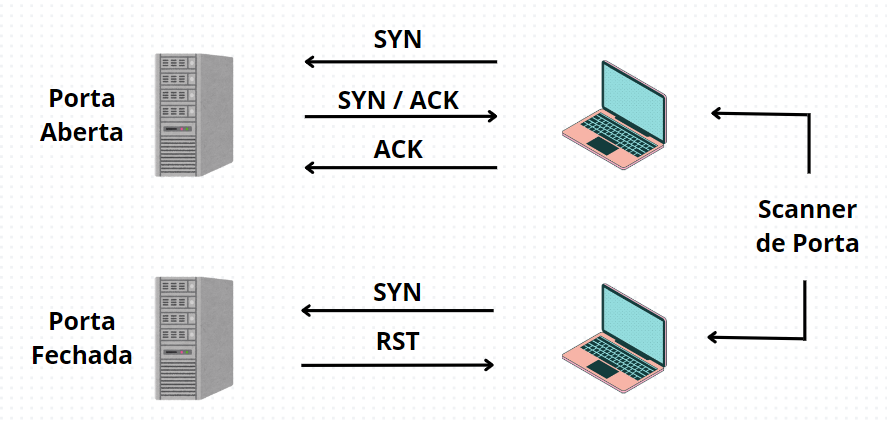
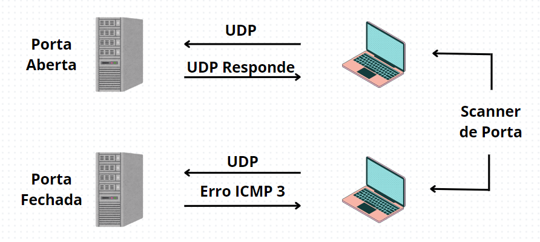
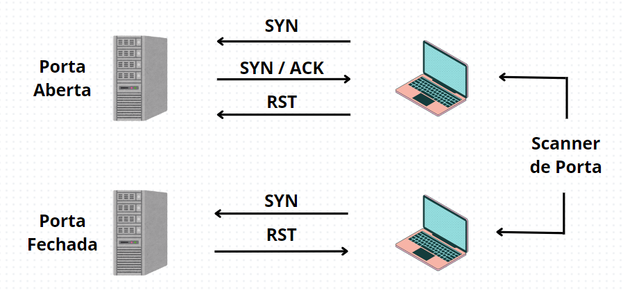

# Port Scanner em Python

###

### Projeto em Python visando um Port Scanner

##

#### O que é um Port Scanner?

    Um scanner de porta é uma ferramenta de rede com o intuito de mapear portas TCP e UDP para identificação das mesmas e verificação do status, normalmente retornando "Aberta" ou "Fechada"

#### Usos de um Port Scanner

    Verificando as portas abertas e fechadas é possível saber os serviços rodando em uma rede, encontrar possíveis vulnerabilidades e identificar falhas na rede.

##

# Aprimoramento do Port Scanner

#### Métodos de Scan

    Um scanner de portas pode usar diferentes métodos para varrer a rede, desde o mais simples até métodos evasivos que são aqueles que fazem menus "barulho" no alvo.

    TCP Scan - varredura mais utilizada em todos Port Scanners, equivale uma requisição (handshake) para cada porta definida, este tipo de varredura é considerada "barulhenta", ou seja, é de fácil detecção.

###

###

    UDP Scan - Este tipo de varredura descobre serviços UDP rodando na rede, ou seja, as portas UDP abertas.

    Portas UDP abertas podem detectar que há serviços VoIP, de Streaming de vídeo e outros rodando em uma rede.

###

###

    SYN Scan - Este tipo de varredura é considerada Stealth ("furtiva"), pois é menos barulhenta devido ao tipo de requisição TCP que ela faz, sem completar a conexão com o alvo.

###

###
